# Deploy-Tutorial-A1-Simulation
A1 Simulation Isaac Sim Usage Tutorial 部署教程

原仓库URL:https://github.com/userguide-galaxea/A1_Simulation_Isaac_Sim_Usage_Tutorial

本仓库提供在2025/6/7的使用教程在Windows(不完整)和Ubuntu22.04LTS(完整版)

## 下载 Omniverse Launcher (Windows和Ubuntu相同)

(这部分和原仓库相同)

1.**访问页面：**

前往 NVIDIA 官网 
https://docs.omniverse.nvidia.com/isaacsim/latest/installation/install_workstation.html 下载 Omniverse Launche

Visit the page: Go to NVIDIA's official website at https://docs.omniverse.nvidia.com/isaacsim/latest/installation/install_workstation.html and download the Omniverse Launcher.  

2.**注册账户:** 

下载过程中，系统可能会提示您登录。如果您没有 NVIDIA 账户，请按照说明注册。注册完成后，继续下载。

Register an account: During the download process, you may be prompted to log in. If you don't have an NVIDIA account, follow the instructions to register. Once registered, continue with the download.  

3.**安装 Omniverse Launcher：**

下载完成后，启动安装程序，按照提示完成安装。

Install Omniverse Launcher: After the download is complete, launch the installer and follow the prompts to complete the installation.  

4.**启动 Omniverse Launcher：**

安装完成后，打开 Omniverse Launcher。首次使用时，您需要使用已注册的 NVIDIA 帐户登录。

Launch Omniverse Launcher: Once the installation is complete, open the Omniverse Launcher. For the first time use, you will need to log in with your registered NVIDIA account.  

5.**设置路径：**

登录后，系统会提示您配置一些相关的文件路径，请根据您的需求进行设置。

Set up paths: After logging in, the system will prompt you to configure some related file paths. Set them up according to your needs.  

6.**安装 Cache：** 

按照系统提示安装 Cache。建议选择默认安装选项，以提升您的使用体验。

Install Cache: Follow the system prompts to install Cache. It is recommended to choose the default installation option to enhance your experience.  

7.**进入主界面：** 

完成这些设置后，您将进入 Omniverse Launcher 主界面。

Access the main interface: Once these settings are completed, you will enter the Omniverse Launcher main interface.  

## 检查你的电脑配置是否满足Isaac Sim的需求

Check if your computer configuration meets the requirements of Isaac Sim

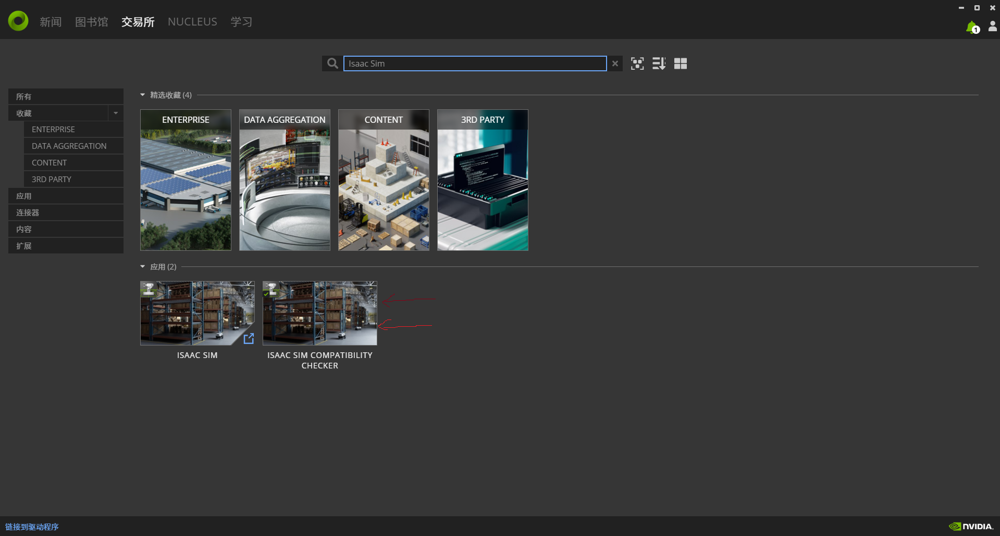
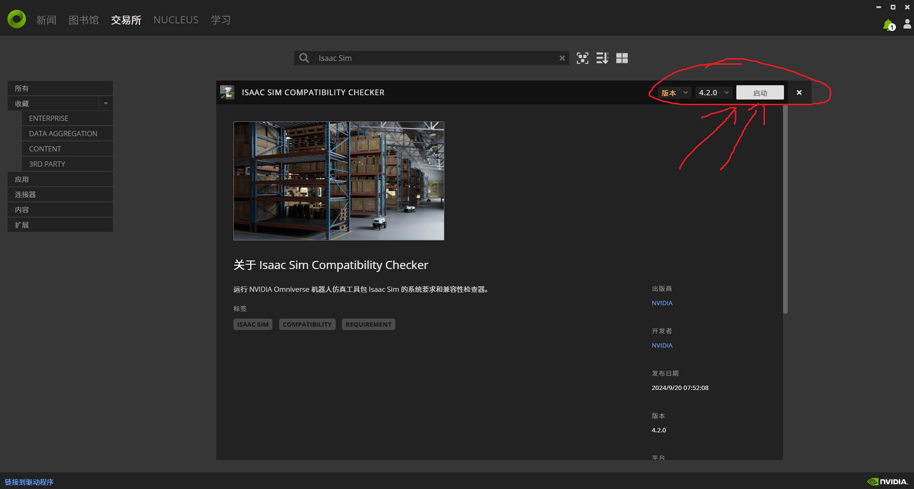

1.打开Omniverse launcher,在交易所搜索Isaac Sim，选中Isaac Sim Compatibility Checker，安装后启动

Open Omniverse launcher, search for Isaac Sim in the exchange, select Isaac Sim Compatibility Checker, install and launch it

2.如果界面没有异常信息，说明符合需求，如果有异常，则自己根据其修改，比如下图符合要求，只是VRAM和RAM并不非常富足

If there is no abnormal information on the interface, it means that it meets the requirements. If there is an abnormality, modify it yourself. For example, the following figure meets the requirements, but the VRAM and RAM are not very abundant.

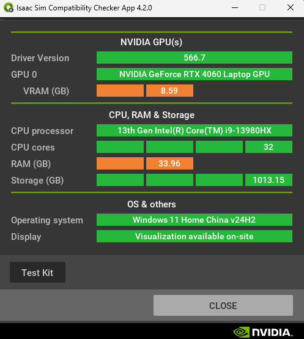

## 下载Isaac Sim(Windows和Ubuntu相同)

Download Isaac Sim (same for Windows and Ubuntu)

**1.**
打开Omniverse launcher,在交易所搜索Isaac Sim，选中Isaac Sim，这里没有直接安装的选项，只能选择跳转外部链接URL: https://docs.isaacsim.omniverse.nvidia.com/latest/installation/download.html，直接下载最新版，4.0.0要在Omniverse启动，但你下载的Omniverse大概率无法导入apps

Open Omniverse launcher, search for Isaac Sim in the exchange, select Isaac Sim, there is no option to install directly, you can only choose to jump to the external link URL: https://docs.isaacsim.omniverse.nvidia.com/latest/installation/download.html, directly download the latest version, 4.0.0 to start in Omniverse, but the Omniverse you downloaded is likely to be unable to import apps

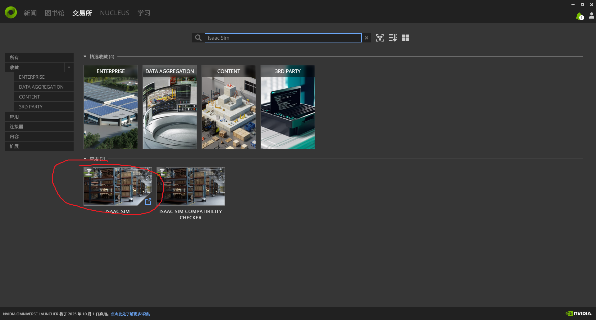

**2.**
打开链接，选择windows的Isaac Sim进行下载，Ubuntu则选择Linux的进行下载

Open the link and select Isaac Sim for Windows to download

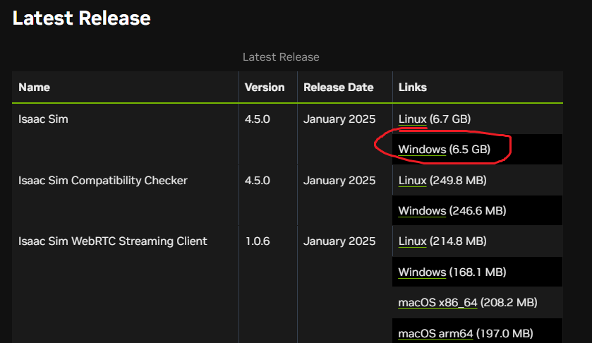

## 安装Isaac Sim(Windows)

Install Isaac Sim (Windows)

**3.**
下载得到压缩文件后解压，双击isaac-sim.bat文件，首次打开需要几分钟

After downloading the compressed file, unzip it and double-click the isaac-sim.bat file. It will take several minutes to open it for the first time.

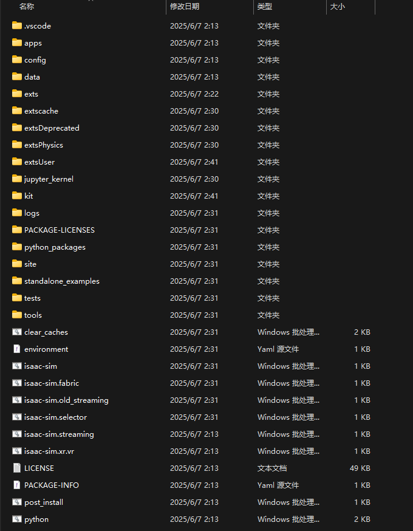
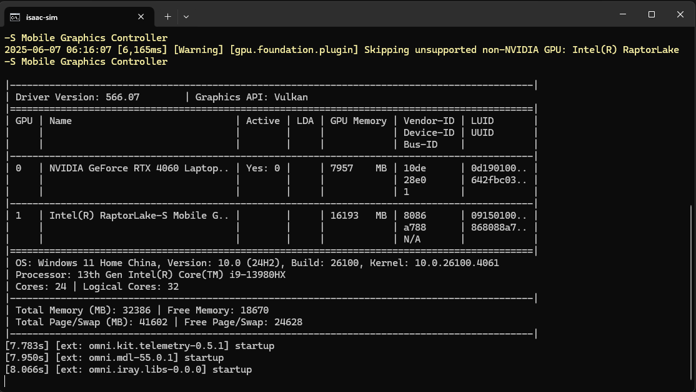

**4.**
打开了Isaac Sim后，有初始化，open-file-选中对应A1_simulation中的文件，即可打开

After opening Isaac Sim, initialize it, open-file-select the file corresponding to A1_simulation, and you can open it

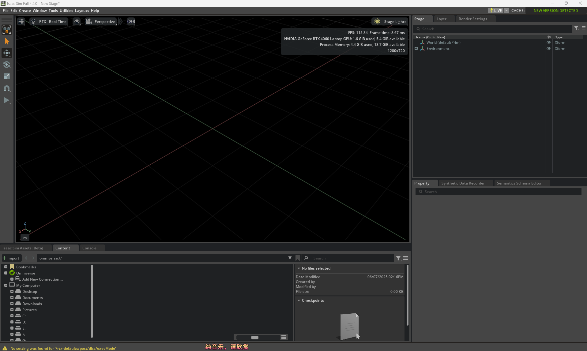
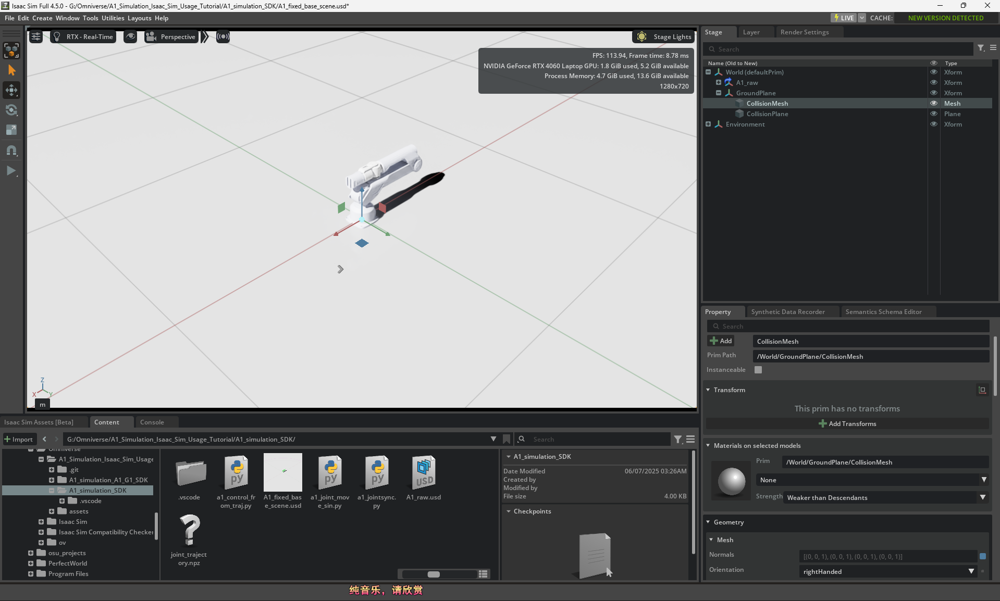

**5.**
左上角window-extension搜索isaacsim-ros1-bridge安装后启动

In the upper left corner, search for isaacsim-ros1-bridge in window-extension and start it after installation.

## 安装Isaac Sim(Ubuntu22.04LTS)

**3.**
下载ROS1，这个自己上网寻找教程，非常简单；然后将下载的IsaacSim压缩包解压到文件夹下，比如我的/home/suzumiyaharuhi/IsaacSim，在这个路径下，应该有isaac-sim.sh这个文件，在这里打开终端，输入指令./isaac-sim.sh，启动了IsaacSim，会有几次无响应，选择等待，注意你的终端不能在特殊环境下(比如conda)！！

After downloading ROS1, unzip the IsaacSim compressed package to a folder, such as /home/suzumiyaharuhi/IsaacSim. In this path, there should be a file called isaac-sim.sh. Open the terminal here and enter the command ./isaac-sim.sh. IsaacSim will start. There will be several times of no response. Choose to wait. Note that your terminal cannot be in a special environment (such as conda)! !

**4.**
打开了Isaac Sim后，有初始化，open-file-选中对应A1_simulation中的文件，即可打开；左上角window-extension搜索isaacsim-ros1-bridge安装后启动(最好设置每次启动isaacsim自启动该拓展)。

After opening Isaac Sim, initialize it. Open-file-select the corresponding file in A1_simulation to open it; search for isaacsim-ros1-bridge in the upper left corner of window-extension and start it after installation (it is best to set it to start automatically every time you start isaacsim).
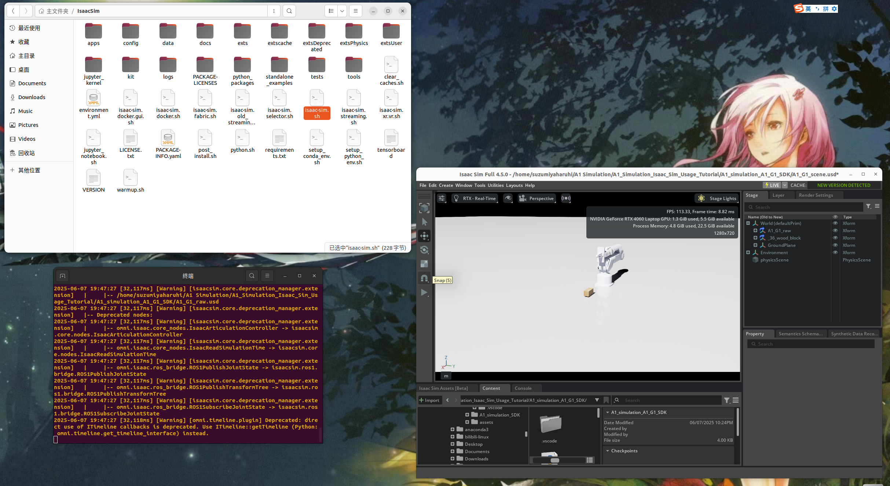
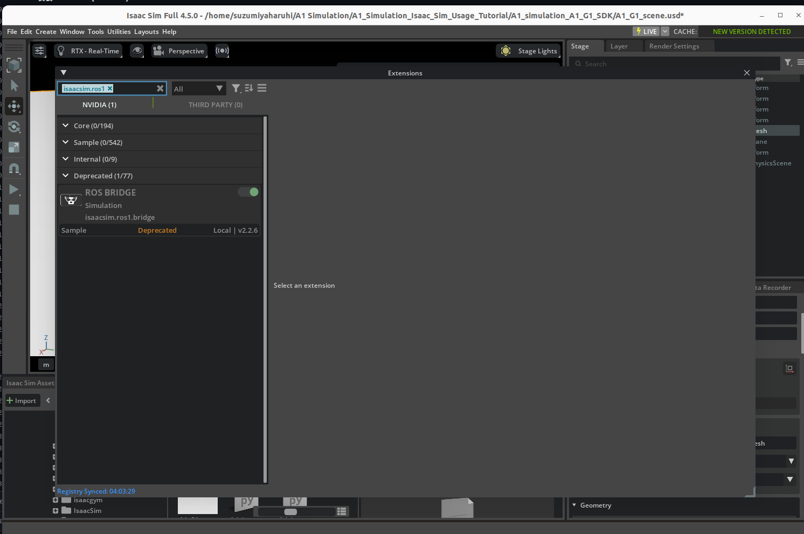
**5.**
在isaac sim点击play键，创建第一个终端为ROS Master，你只需要在该终端输入指令roscore即可，在你的脚本文件夹创建第二个终端，输入python3 脚本名，比如python3 a1_joint_move_sin.py，即可运行

Click the play button in isaac sim to create the first terminal as ROS Master. You only need to enter the command roscore in this terminal. Create a second terminal in your script folder and enter the python3 script name, such as python3 a1_joint_move_sin.py, to run it.

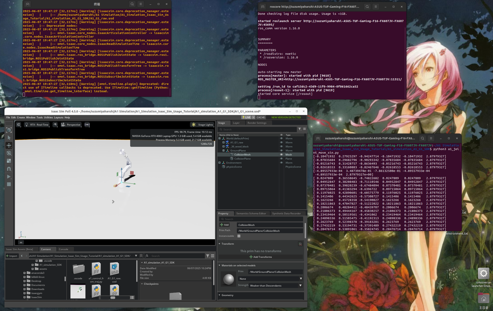

